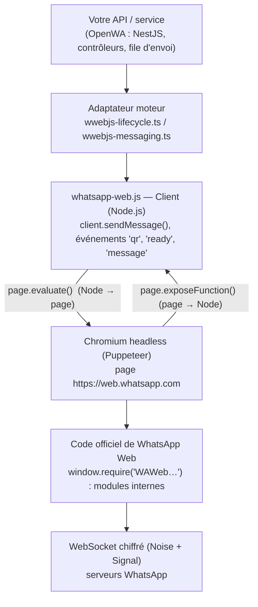

# Rapport : comment OpenWA pilote WhatsApp Web via un navigateur émulé, et comment le reproduire

> Analyse du code d'OpenWA v0.23.4 (`whatsapp-web.js` 1.34.7, `puppeteer` 24.38.0, `@whiskeysockets/baileys` 7.0.0-rc14).

---

## 1. En bref

OpenWA n'utilise **aucune API officielle** de WhatsApp. Il a deux moteurs interchangeables derrière une même interface (`src/engine/interfaces/whatsapp-engine.interface.ts`) :

| Moteur | Principe | Fichiers clés |
|---|---|---|
| **whatsapp-web.js** (celui qui vous intéresse) | Lance un **vrai Chromium headless** via Puppeteer, ouvre `https://web.whatsapp.com`, puis **injecte du JavaScript dans la page** pour appeler directement les modules internes de WhatsApp Web. | `src/engine/adapters/wwebjs-lifecycle.ts`, `wwebjs-messaging.ts`, `node_modules/whatsapp-web.js/src/Client.js`, `.../util/Injected/Utils.js` |
| **Baileys** | Pas de navigateur : ré-implémente le protocole WebSocket + chiffrement Signal de WhatsApp en Node.js pur. | `src/engine/adapters/baileys-*.ts` |

L'idée centrale du moteur navigateur : **on ne simule pas des clics**. On laisse le vrai code de WhatsApp Web (chiffrement, WebSocket, gestion des clés) tourner dans Chromium, et on appelle ses fonctions internes depuis Node.js avec `page.evaluate(...)`. Le navigateur sert d'« environnement d'exécution » pour le client officiel.

---

## 2. Architecture en couches



Deux canaux relient Node.js et la page :

- **Node → page** : `page.evaluate(fn, ...args)` exécute une fonction dans la page et renvoie le résultat sérialisé (JSON). C'est ainsi qu'on **envoie** un message.
- **Page → Node** : `page.exposeFunction('onAddMessageEvent', cb)` crée une fonction globale `window.onAddMessageEvent` dans la page ; l'appeler depuis la page déclenche `cb` côté Node. C'est ainsi qu'on **reçoit** les messages, le QR code, etc. (`node_modules/whatsapp-web.js/src/util/Puppeteer.js`).

---

## 3. Le cycle de démarrage, étape par étape

### 3.1 Lancement de Chromium (`Client.initialize()`, `Client.js:438`)

OpenWA construit les options Puppeteer dans `wwebjs-lifecycle.ts:199-238` et `:361-389` :

```ts
args: [
  '--no-sandbox', '--disable-setuid-sandbox',   // nécessaire en conteneur / root
  '--disable-dev-shm-usage',                     // /dev/shm trop petit dans Docker
  '--disable-accelerated-2d-canvas', '--no-first-run', '--no-zygote', '--disable-gpu',
  `--proxy-server=...`,                          // optionnel, un proxy par session
  `--openwa-session=${sessionId}`,               // marqueur pour retrouver les processus orphelins
]
headless: true
handleSIGINT/SIGTERM/SIGHUP: false               // l'app gère elle-même l'arrêt propre
protocolTimeout: ...                             // budget max d'une commande CDP
```

whatsapp-web.js ajoute lui-même deux éléments d'« émulation » (`Client.js:461-483`) :

- `--disable-blink-features=AutomationControlled` → masque `navigator.webdriver = true`, le signal le plus évident d'un navigateur automatisé ;
- un **User-Agent de Chrome desktop classique** (`Constants.js`), appliqué en argument de lancement et par `page.setUserAgent()`.

### 3.2 Persistance de la session (`LocalAuth`)

`LocalAuth` (`authStrategies/LocalAuth.js`) se contente de donner à Chromium un **profil utilisateur dédié** : `userDataDir = <dataPath>/session-<clientId>`. Toutes les clés de WhatsApp Web (IndexedDB, localStorage) y sont stockées par le navigateur lui-même. Au redémarrage, Chromium relit ce profil et la session est restaurée **sans rescanner le QR**.

Conséquences pratiques relevées dans OpenWA :

- **un profil = une session = un seul Chromium à la fois**. Deux navigateurs sur le même profil corrompent les identifiants (`wwebjs-lifecycle.ts:423-427`) ;
- après un `kill -9`, Chromium laisse des verrous `SingletonLock/SingletonSocket/SingletonCookie` qui bloquent le relancement. OpenWA les supprime avant chaque lancement, et tue les Chromium orphelins identifiés par le marqueur `--openwa-session=` (`chromium-profile-hygiene.ts`) ;
- `disconnect()` fait `client.destroy()` (ferme le navigateur, **garde** le profil) ; `logout()` fait `client.logout()` (délie l'appareil **et supprime** le profil).

### 3.3 Épinglage de la version de WhatsApp Web (très important)

WhatsApp modifie son code web en continu, et certaines versions cassent l'injection. OpenWA **fige la version** (`src/engine/wa-web-version.ts`) :

1. il télécharge le registre communautaire `wppconnect-team/wa-version/versions.json` ;
2. il choisit la version **non-beta, non expirée, publiée depuis au moins 12 h** (`pickSettledWebVersion`) ;
3. il passe à whatsapp-web.js `webVersion` + `webVersionCache: { type: 'remote', remotePath: '.../html/{version}.html' }`.

whatsapp-web.js active alors l'**interception de requêtes** Puppeteer (`Client.js:1251`) : quand la page demande `https://web.whatsapp.com/`, il répond avec le HTML archivé de la version choisie au lieu du HTML actuel. Tous les autres fichiers (JS, WebSocket) passent normalement.

> ⚠️ Ce HTML est exécuté dans l'origine `web.whatsapp.com` sans contrôle d'intégrité. OpenWA l'annonce dans les logs et propose `WWEBJS_WEB_VERSION=off` ou une copie hébergée par vos soins.

### 3.4 Chargement de la page et injection (`Client.inject()`, `Client.js:118`)

```
page.goto('https://web.whatsapp.com/', { referer: 'https://whatsapp.com/' })
    │
    ├─ attendre que window.Debug.VERSION existe      → le bundle WhatsApp a démarré
    ├─ page.evaluate(ExposeAuthStore)                → récupère les modules d'auth internes
    ├─ lire window.require('WAWebSocketModel').Socket.state
    │     ├─ UNPAIRED / UNPAIRED_IDLE → besoin d'appairage (QR ou code)
    │     └─ sinon → session restaurée depuis le profil
    ├─ exposeFunction('onQRChangedEvent')            → QR vers Node
    ├─ exposeFunction('onAppStateHasSyncedEvent')    → « synchronisé »
    └─ Socket.on('change:hasSynced') → onAppStateHasSyncedEvent()
```

**`window.require`** est la clé de tout : WhatsApp Web est bâti sur le système de modules interne de Meta, qui reste accessible dans la page. `window.require('WAWebCollections')`, `window.require('WAWebSendMsgChatAction')`… donnent accès aux mêmes fonctions que celles utilisées par l'interface quand un humain clique sur « Envoyer ».

### 3.5 Appairage

**QR code** (`Client.js:227-280`) : le contenu du QR n'est pas lu à l'écran ; il est **reconstruit** à partir des données internes :

```
ref , clé publique Noise , clé publique d'identité , clé secrète ADV , plateforme
```

Chaque rotation du `ref` (`AuthStore.Conn.on('change:ref')`) produit un nouveau QR, envoyé à Node via `onQRChangedEvent`. OpenWA le convertit en image data-URL avec `qrcode.toDataURL()` (`wwebjs-lifecycle.ts:484`).

**Code d'appairage à 8 caractères** (option « Lier avec un numéro ») : `client.requestPairingCode(phone)` appelle `AuthStore.PairingCodeLinkUtils.startAltLinkingFlow(...)`. Comme la page se recharge environ toutes les 20 s tant qu'elle n'est pas appairée, OpenWA fait jusqu'à 4 tentatives de 15 s (`wwebjs-lifecycle.ts:1026`).

### 3.6 Passage à l'état « prêt »

Quand `Socket.hasSynced` devient vrai :

1. événement `authenticated` ;
2. `page.evaluate(LoadUtils)` → installe `window.WWebJS` (tous les helpers : `sendMessage`, `getChat`, sérialiseurs…) ;
3. lecture des infos du compte (`WAWebUserPrefsMeUser`) ;
4. `attachEventListeners()` → branche les collections internes (`Msg.on('add')`, `Msg.on('change:ack')`, etc.) sur des fonctions exposées ;
5. événement `ready`.

---

## 4. Envoyer un message : le chemin complet

### Côté Node (`Client.sendMessage`, `Client.js:1397`)

Normalise les options (mentions, média, citation…) puis **un seul** `page.evaluate` :

```js
const chat = await window.WWebJS.getChat(chatId, { getAsModel: false });
if (!chat) return null;
if (sendSeen) await window.WWebJS.sendSeen(chatId);   // marque la conversation lue, comme un humain
const msg = await window.WWebJS.sendMessage(chat, content, options);
return window.WWebJS.getMessageModel(msg);             // objet sérialisable renvoyé à Node
```

### Côté page (`Injected/Utils.js`)

1. **`getChat`** : `WAWebWidFactory.createWid('221771234567@c.us')`, puis `Chat.get(wid)` ou `WAWebFindChatAction.findOrCreateLatestChat(wid)` (crée la conversation si elle n'existe pas).
2. **`sendMessage`** construit un objet message :
   - un identifiant `WAWebMsgKey.newId()` et une clé `{ from: moi, to: chat.id, id, selfDir: 'out' }` ;
   - le type (`chat`, `image`, `location`, `poll_creation`, `vcard`…), le corps, la citation, les mentions, l'aperçu de lien, les champs éphémères ;
   - pour un média : `processMediaData` fait l'upload chiffré via les modules internes et renvoie un `mediaHandle`.
3. **`WAWebSendMsgChatAction.addAndSendMsgToChat(chat, message)`** : c'est exactement la fonction appelée par le bouton « Envoyer ». Elle ajoute le message à la conversation, **le chiffre avec Signal et l'envoie sur le WebSocket**.

Vous n'avez donc jamais à gérer le chiffrement : c'est le code officiel qui le fait.

### Accusés de réception

`Msg.on('change:ack')` → `message_ack` côté Node. Valeurs : `-1` erreur, `0` en attente, `1` serveur, `2` distribué, `3` lu, `4` écouté (mappées dans `wwebjsAckToDeliveryStatus`, `wwebjs-messaging.ts:31`).

### Ce qu'OpenWA ajoute autour (`wwebjs-messaging.ts`)

- **Résolution des identifiants LID** : WhatsApp migre des contacts vers des identifiants anonymes `xxx@lid`. Envoyer à `numéro@c.us` peut échouer avec `No LID for user`. OpenWA appelle d'abord `client.getNumberId()` (qui interroge `WAWebQueryExistsJob.queryWidExists` et vérifie au passage que le numéro a WhatsApp), met le résultat en cache, et en cas d'erreur **re-résout une fois puis réessaie** (`resolveSendId`, `sendResolved`).
- **Retour `undefined`** : `sendMessage` peut réussir sans renvoyer de message, ou échouer silencieusement (conversation introuvable). OpenWA traite ce cas comme un échec (`toMessageResult`).
- **Citations** : `ignoreQuoteErrors: false`, sinon une citation introuvable envoie un message non cité sans erreur.
- **Documents** : `sendMediaAsDocument: true`, sinon une image envoyée comme document arrive recompressée en photo.
- **Médias distants** : téléchargement côté Node avec protection SSRF, puis `new MessageMedia(mime, base64, filename)`.

---

## 5. Recevoir des messages

Dans la page : `Msg.on('add', msg => { if (msg.isNewMsg) window.onAddMessageEvent(getMessageModel(msg)) })` (`Client.js:1138`).
Côté Node : `onAddMessageEvent` émet `message_create` (tous les messages, y compris les vôtres) puis `message` (uniquement les messages reçus).

---

## 6. Ce qui casse en production, et ce qu'OpenWA a mis en place

C'est la partie la plus précieuse du projet : la majorité du code sert à rendre le navigateur fiable, pas à envoyer des messages.

| Problème | Solution OpenWA | Où |
|---|---|---|
| Une nouvelle version de WhatsApp Web casse l'injection ou bloque sur « authenticating » | Épinglage d'une version publiée depuis plus de 12 h | `wa-web-version.ts` |
| Chromium plante et le client reste « READY » pour toujours | Écoute `browser.on('disconnected')`, `page.on('error')`, `page.on('close')` → déconnexion + reconnexion | `wwebjs-lifecycle.ts:628` |
| Une page figée continue de répondre « CONNECTED » | **Watchdog** : toutes les 60 s, `client.getState()` avec un timeout de 10 s ; 2 échecs consécutifs → session considérée morte | `session-liveness-watchdog.service.ts` |
| Erreurs `Target closed`, `Protocol error`, `Session closed` pendant un envoi | Classées comme mort du transport → reconnexion immédiate (sauf `protocolTimeout`, simple lenteur) | `isPageTransportError` |
| WhatsApp Web recharge la page (environ 5 min après un premier appairage, mise à jour du service worker) | whatsapp-web.js réinjecte sur `framenavigated` ; OpenWA accorde un délai de grâce de 60 s (plafond 180 s) pour ne pas tuer une page en cours de réinjection | `NAVIGATION_REINJECT_GRACE_MS` |
| Navigation pendant la toute première injection | Une seule nouvelle tentative, seulement s'il reste assez de temps | `isNavigationShapedInitRejection` |
| `ready` jamais émis (profil déjà synchronisé) ou émis trop tôt | Patch de la librairie (drapeau `eventsAttached`) + **réconciliation** : sondage toutes les 2 s pendant 90 s, puis rechargement ou réappairage | `wwebjs-reconcile.ts`, `scripts/patch-wwebjs-ready-sync.js` |
| Fenêtre « Quoi de neuf ? » non fermée → appareil délié environ 5 min plus tard | Un watcher clique sur « Continue » dans la page | `wwebjs-onboarding.ts` |
| Chromium orphelin / verrous du profil après un crash | Nettoyage avant chaque lancement | `chromium-profile-hygiene.ts` |
| Reconnexions en boucle | Backoff exponentiel avec jitter, remise à zéro après 5 min de stabilité, plafond d'1 h | `session/reconnect-policy.ts` |
| `LOGOUT`, `TOS_BLOCK`, `PROXYBLOCK` | LOGOUT = rescanner obligatoirement ; TOS/PROXY = compte ou IP sanctionné, remonté comme « restriction » | `WA_STATE_RESTRICTIONS` |
| Fonctions internes de WhatsApp Web renommées ou supprimées | Scripts qui **patchent** `node_modules/whatsapp-web.js` au `postinstall`, avec échec explicite si le code source ne correspond plus | `scripts/patch-wwebjs-*.js` |
| **Bannissement** du numéro | *Send pacing* : plafond journalier progressif pour un compte neuf (20 → 40 → 80 … → 1000/jour), plafond de premiers contacts, disjoncteur après 5 échecs consécutifs (pause de 15 min) | `message/send-pacing.*` |

---

## 7. Comment l'implémenter dans votre application

### 7.1 Choix de départ

**Ne réécrivez pas l'injection vous-même** avec Puppeteer brut. Les noms `WAWeb…` changent régulièrement ; whatsapp-web.js est maintenu par une communauté qui suit ces changements (et OpenWA doit malgré tout le patcher). Utilisez la librairie et reprenez les protections d'OpenWA autour.

| | whatsapp-web.js (navigateur) | Baileys (sans navigateur) |
|---|---|---|
| Ressources | ~150–400 Mo de RAM **par session** (un Chromium chacune) | ~20–50 Mo par session |
| Fidélité | Maximale : c'est le vrai client web | Ré-implémentation, parfois en retard sur le protocole |
| Dépendances système | Chromium + bibliothèques (Docker plus lourd) | Node.js seul |
| Robustesse | Pages figées, rechargements, versions web | Changements de protocole |
| Recommandé si | Peu de sessions, besoin de fonctions « comme un humain » | Beaucoup de sessions, serveur modeste |

Le plus sûr est de faire comme OpenWA : **une interface `WhatsAppEngine`** et un adaptateur par moteur, pour pouvoir en changer sans toucher au reste.

### 7.2 Installation

```bash
npm i whatsapp-web.js@1.34.7 puppeteer qrcode
# Linux sans Docker : installer les dépendances de Chromium
# (libnss3 libatk-bridge2.0-0 libgbm1 libxkbcommon0 libasound2 fonts-liberation ...)
```

Épinglez **la version exacte** de whatsapp-web.js et mettez à jour volontairement, après test.

### 7.3 Version minimale fonctionnelle

```js
// wa.js
const { Client, LocalAuth, MessageMedia } = require('whatsapp-web.js');
const qrcode = require('qrcode');

const client = new Client({
  authStrategy: new LocalAuth({ clientId: 'session-1', dataPath: './wa-data' }),
  puppeteer: {
    headless: true,
    args: ['--no-sandbox', '--disable-setuid-sandbox', '--disable-dev-shm-usage',
           '--disable-gpu', '--no-first-run', '--no-zygote'],
    handleSIGINT: false, handleSIGTERM: false, handleSIGHUP: false,
  },
  // Épinglage de version (voir 7.4)
  webVersion: '2.3000.XXXXXXX',
  webVersionCache: {
    type: 'remote',
    remotePath: 'https://raw.githubusercontent.com/wppconnect-team/wa-version/main/html/{version}.html',
  },
});

client.on('qr', async qr => {
  const dataUrl = await qrcode.toDataURL(qr);    // à afficher dans votre interface
  console.log('QR prêt');
});
client.on('authenticated', () => console.log('Authentifié'));
client.on('ready', () => console.log('Prêt :', client.info.wid.user));
client.on('auth_failure', m => console.error('Échec auth (rescanner) :', m));
client.on('disconnected', reason => console.warn('Déconnecté :', reason));
client.on('message', msg => console.log('Reçu de', msg.from, ':', msg.body));
client.on('message_ack', (msg, ack) => console.log('ack', msg.id._serialized, ack));

client.initialize();

// Envoi, à n'appeler qu'une fois 'ready' reçu
async function sendText(phone, text) {
  const wid = await client.getNumberId(phone);     // null si le numéro n'a pas WhatsApp
  if (!wid) throw new Error('Numéro sans WhatsApp');
  return client.sendMessage(wid._serialized ?? wid.$1, text);   // voir 7.4 point 7 pour `$1`
}

async function sendFile(phone, path, caption) {
  const wid = await client.getNumberId(phone);
  const media = MessageMedia.fromFilePath(path);
  return client.sendMessage(wid._serialized ?? wid.$1, media, { caption });
}

process.on('SIGTERM', async () => { await client.destroy(); process.exit(0); });
```

Format des identifiants : `<indicatif><numéro sans +>@c.us` pour une personne (ex. `221771234567@c.us`), `...@g.us` pour un groupe, `...@lid` pour un contact migré.

### 7.4 Architecture recommandée pour une vraie application

```
src/whatsapp/
  engine.interface.ts      // initialize, sendText, sendMedia, getStatus, getQR, logout, destroy, probeLiveness
  wwebjs.adapter.ts        // implémentation whatsapp-web.js (inspirée de wwebjs-lifecycle.ts)
  web-version.ts           // copie adaptée de src/engine/wa-web-version.ts
  chromium-hygiene.ts      // copie de chromium-profile-hygiene.ts
  session.manager.ts       // Map<sessionId, adapter>, watchdog, reconnexion avec backoff
  send.queue.ts            // file d'envoi par session (BullMQ/Redis ou file en mémoire)
  pacing.ts                // plafonds journaliers + délais aléatoires + disjoncteur
```

**1. Machine à états par session** (reprenez `EngineStatus`) :
`DISCONNECTED → INITIALIZING → QR_READY → AUTHENTICATING → READY`, plus `FAILED`. Refusez tout envoi hors `READY` (`ensureReady()`).

**2. Démarrage sûr** (ordre utilisé par `runInitAttempt`) :
1. résoudre la version épinglée ;
2. tuer les Chromium orphelins de cette session (marqueur `--<app>-session=<id>` dans les args) ;
3. supprimer `SingletonLock/SingletonSocket/SingletonCookie` du profil ;
4. `new Client(...)` puis brancher **tous** les handlers **avant** `initialize()` ;
5. après `initialize()`, brancher la détection de mort :

```js
client.pupBrowser.on('disconnected', () => onDead('browser closed'));
client.pupPage.on('error',  () => onDead('page crashed'));
client.pupPage.on('close',  () => onDead('page closed'));
```

**3. Watchdog** (toutes les 60 s) :

```js
async function probe(client) {
  try {
    const state = await Promise.race([
      client.getState(),
      new Promise((_, rej) => setTimeout(() => rej(new Error('timeout')), 10_000)),
    ]);
    return state === 'CONNECTED';
  } catch { return false; }
}
// 2 échecs consécutifs → destroy() (voire SIGKILL de pupBrowser.process()) puis reconnexion
```

Ignorez les échecs pendant environ 60 s après un `framenavigated` sur la frame principale (rechargement normal de WhatsApp Web).

**4. Reconnexion** : backoff exponentiel avec jitter (par ex. 5 s, 10 s, 20 s… plafonné), compteur remis à zéro après 5 min de stabilité. Sur `LOGOUT` ou `auth_failure` : ne pas boucler, passer en « rescan requis ».

**5. Arrêt** : `destroy()` pour arrêter en gardant la session ; `logout()` uniquement pour délier. Gérez vous-même SIGTERM (`handleSIG*: false`) pour fermer proprement les navigateurs.

**6. File d'envoi** : ne jamais appeler `sendMessage` en parallèle sans contrôle sur une même session. Une file par session, avec :
- un délai aléatoire entre les messages (par ex. 3 à 10 s), éventuellement `chat.sendStateTyping()` avant l'envoi ;
- un plafond journalier progressif selon l'âge du compte (valeurs par défaut d'OpenWA : `20,40,80,160,320,640,1000`) ;
- un disjoncteur : après 5 échecs « côté WhatsApp » consécutifs, pause de 15 min ;
- une journalisation de chaque message (id, statut, ack) en base.

**7. Envoi robuste** (reprise de `sendResolved`) :

```js
// Les builds WhatsApp Web 2.3000.x (à partir de juillet 2026) ont renommé `_serialized` en `$1` :
// lisez toujours les deux (c'est ce que fait OpenWA avec readWid() et le patch 201832).
const readWid = w => w?._serialized ?? w?.$1 ?? null;

const cache = new Map();
async function resolveId(chatId) {
  if (!chatId.endsWith('@c.us')) return chatId;
  if (cache.has(chatId)) return cache.get(chatId);
  const id = readWid(await client.getNumberId(chatId).catch(() => null));
  if (!id) return chatId;
  cache.set(chatId, id);
  return id;
}

async function safeSend(chatId, content, opts) {
  const to = await resolveId(chatId);
  try {
    const msg = await client.sendMessage(to, content, opts);
    if (!msg) throw new Error('Aucun message renvoyé : envoi incertain');
    return msg;
  } catch (e) {
    if (/Target closed|Protocol error|Session closed/i.test(e.message)) onDead('transport');
    if (e.message.includes('No LID for user')) {
      cache.delete(chatId);
      const fresh = await resolveId(chatId);
      if (fresh !== to) return client.sendMessage(fresh, content, opts);
    }
    throw e;
  }
}
```

**8. Docker** : partez du `Dockerfile` d'OpenWA (Chrome for Testing sur amd64, Chromium Debian sur arm64, `PUPPETEER_EXECUTABLE_PATH`), montez le dossier `dataPath` sur un **volume persistant**, et prévoyez `shm_size` ou `--disable-dev-shm-usage`.

### 7.5 Si vous devez vraiment le faire sans whatsapp-web.js

Le principe tient en quatre étapes, mais attendez-vous à maintenir vous-même la correspondance avec les modules internes :

```js
const browser = await puppeteer.launch({ headless: true, userDataDir: './profile',
  args: ['--no-sandbox', '--disable-blink-features=AutomationControlled'] });
const page = (await browser.pages())[0];
await page.setUserAgent('Mozilla/5.0 ... Chrome/1xx Safari/537.36');
await page.goto('https://web.whatsapp.com/');
await page.waitForFunction('window.Debug?.VERSION != undefined', { timeout: 60_000 });
// ... (QR : voir Client.js:245-280) ...
await page.waitForFunction(() => window.require('WAWebSocketModel').Socket.hasSynced);

const id = await page.evaluate(async (to, text) => {
  const wid  = window.require('WAWebWidFactory').createWid(to);
  const chat = window.require('WAWebCollections').Chat.get(wid)
            || (await window.require('WAWebFindChatAction').findOrCreateLatestChat(wid)).chat;
  // Construire le message (MsgKey, from/to, type 'chat', t, ack…) : voir Injected/Utils.js:145-613
  // puis : window.require('WAWebSendMsgChatAction').addAndSendMsgToChat(chat, message)
}, '221771234567@c.us', 'Bonjour');
```

Reportez-vous à `node_modules/whatsapp-web.js/src/util/Injected/Utils.js` pour la structure exacte du message : c'est la référence la plus à jour dont vous disposez.

---

## 8. Risques à connaître

- **Conditions d'utilisation** : l'automatisation d'un compte WhatsApp personnel est contraire aux CGU de WhatsApp. Le numéro peut être **banni** (état `TOS_BLOCK`). Pour un usage commercial à grande échelle, l'API officielle **WhatsApp Business Cloud API** (Meta) est la seule option sans risque de bannissement.
- **Fragilité** : chaque mise à jour de WhatsApp Web peut casser une fonction. Épinglez les versions, surveillez le dépôt whatsapp-web.js, et gardez une suite de tests sur un numéro de test.
- **Sécurité** : le dossier du profil **est** la session WhatsApp. Quiconque le copie peut envoyer des messages en votre nom. Protégez-le (permissions, chiffrement du volume) comme un mot de passe.
- **Coût** : un Chromium par numéro. Au-delà de quelques dizaines de sessions sur un serveur, envisagez Baileys.

---

## 9. Checklist d'implémentation

- [ ] Interface `WhatsAppEngine` + adaptateur whatsapp-web.js
- [ ] `LocalAuth` avec un `clientId` unique par session et un volume persistant
- [ ] Épinglage de la version de WhatsApp Web (registre wa-version, build de plus de 12 h)
- [ ] Nettoyage des Chromium orphelins et des fichiers `Singleton*` avant lancement
- [ ] Handlers `qr` / `authenticated` / `ready` / `auth_failure` / `disconnected` branchés avant `initialize()`
- [ ] Détection de la mort de Chromium (browser `disconnected`, page `error`/`close`)
- [ ] Watchdog `getState()` + timeout, avec délai de grâce après `framenavigated`
- [ ] Reconnexion avec backoff et jitter ; LOGOUT et auth_failure = rescan requis
- [ ] `getNumberId` avant envoi + cache + nouvelle tentative sur `No LID for user`
- [ ] File d'envoi par session, délais aléatoires, plafonds journaliers, disjoncteur
- [ ] Persistance des messages et des acks
- [ ] Arrêt propre (`destroy`) sur SIGTERM
- [ ] Image Docker avec Chromium et ses dépendances
